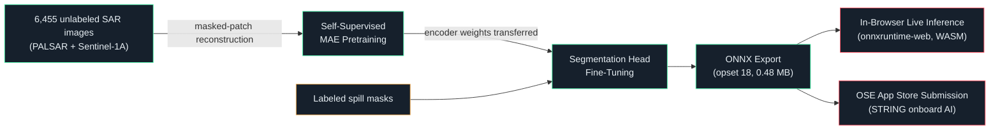

<div align="center">

# 🛰️ NEUTA OceanGuard

### Self-Supervised SAR Oil Spill Segmentation, Validated and Submitted Toward Onboard Satellite Deployment

[] [] [] []

_A two-stage self-supervised → supervised pipeline that detects oil spills in SAR satellite imagery — trained, benchmarked against ground truth, stress-tested for failure modes, exported to ONNX, and built toward submission on [STAR.VISION's OSE App Store](https://oseappstore.com/) for onboard satellite AI._

[**🚀 Try the live demo**] · [Results]· [Limitations]· [Architecture]

</div>

----------

## What This Is

Most SAR oil-spill detectors are trained from scratch on a comparatively small labeled dataset and reported with a single accuracy number. This project does something more deliberate:

1.  **Pretrains** a Vision Transformer encoder using masked-autoencoding (self-supervised — no labels) on the _entire_ training set, so the model learns general SAR texture and structure before ever seeing a spill label.
2.  **Fine-tunes** a segmentation head on top of that encoder using labeled spill masks.
3.  **Validates honestly** — not just an aggregate metrics table, but a targeted investigation into _where the model actually fails_, with numbers to back it up.
4.  **Ships as ONNX** with a verified-correct in-browser inference app, so anyone can run the real model with zero install, zero backend, and zero cost.



----------
## 📊 Results

Benchmarked on a **1,615-image held-out test set** — never touched during pretraining, fine-tuning, or hyperparameter/early-stopping decisions.

| Metric | Combined | PALSAR (L-band) | Sentinel-1A (C-band) |
|---|:---:|:---:|:---:|
| Precision | 0.7995 | 0.7357 | 0.8313 |
| Recall | 0.8920 | 0.8846 | 0.8953 |
| **IoU** | **0.7289** | 0.6712 | 0.7577 |
| Dice / F1 | 0.8432 | 0.8033 | 0.8621 |
| Pixel Accuracy | 0.9134 | 0.9272 | 0.9006 |

In line with—slightly above—published benchmarks for this dataset family.

### Inference Performance

| Metric | Value |
|---|---|
| Latency | **56.2 ms/image** (~17.8 img/sec) |
| Model Size | **0.48 MB** |
| PyTorch → ONNX Numerical Fidelity | Maximum difference: `2.3e-5` (floating-point noise) |

> **Note:** Recall consistently exceeds precision, meaning the model is intentionally more likely to over-flag than under-flag oil spills. For an environmental monitoring system, this is the safer failure mode: a false positive costs additional verification, while a false negative risks missing a real spill.

---

## 🔍 Known Limitations (read this)

A model card that only lists strengths isn't a model card, it's a press release. Here's what actually breaks:

**Other things worth knowing before deploying this anywhere:**

-   Trained on ALOS PALSAR (L-band, discontinued sensor) + Sentinel-1A (C-band) — a different SAR payload will need some fine-tuning before deployment-grade claims hold.
-   PALSAR underperforms Sentinel-1A across every metric (IoU 0.67 vs. 0.76) — some L-band/C-band gap is expected, but worth tracking.
-   Trained on a curated, pre-cropped academic benchmark — real onboard imagery will be noisier.
-   Binary segmentation only — doesn't separately classify ships or SAR look-alikes (low-wind zones, algae blooms), a known false-positive source in this task generally.

----------

## 🚀 Run the Live Demo (30 seconds, no install)

The trained model runs **entirely in your browser** via WebAssembly — no Python, no server, no API key, your image never leaves your machine.

```bash
git clone https://github.com/ShehryarKhan123-ship-it/Oil-Spill-Segmentaiton-VIT.git

```

Then just open `live-inference/oceanguard_live_inference.html` in a browser (Chrome/Edge/Firefox).

> **Note:** double-clicking the file directly can hit browser CORS restrictions on loading the WASM runtime from a `file://` path. If the model fails to load, serve it locally instead — one line, no setup:
> 
> ```bash
> cd live-inference
> python3 -m http.server 8000
> 
> ```
> 
> Then open `http://localhost:8000/oceanguard_live_inference.html`.

Once it's open:

1.  Click **"Load oceanguard_segmodel.onnx"** → select `models/oceanguard_segmodel.onnx`
2.  Click **"Load a SAR image"** → pick any SAR image (or a screenshot of one)
3.  Hit **RUN INFERENCE** → see the predicted spill mask overlaid live, with latency and coverage stats

The app runs a sanity check the moment your model loads (a blank-tensor forward pass) and logs the detected input/output tensor names and shapes — so if anything about the model doesn't match what's expected, you'll see exactly why in the on-screen console log rather than a silent failure.

----------

## 🏗️ Architecture

**Stage 1 — Self-supervised pretraining (Masked Autoencoder).** A ViT-style encoder/decoder is trained on all 6,455 unlabeled training images (both sensors, labels ignored entirely) to reconstruct randomly masked image patches. This is the standard trick for getting strong representations out of a dataset where labels are comparatively scarce relative to raw imagery — the same broad recipe behind modern geospatial foundation models.

**Stage 2 — Supervised fine-tuning.** The pretrained encoder initializes a segmentation model: patch tokens are reshaped back into a spatial grid, then a lightweight convolutional decode head progressively upsamples it to a full-resolution binary spill mask. Trained with a combined Dice + BCE loss (oil-spill pixels are a small minority of most frames — plain BCE alone tends to collapse to predicting "all background").

**Stage 3 — Export & validation.** Exported to ONNX (opset 18), verified numerically identical to the PyTorch model, benchmarked for latency/size, and stress-tested specifically for the multi-instance failure mode documented above — not just reported on the easy aggregate number.

----------

## 📁 Repo Structure

```
neuta-oceanguard/
├── README.md
├── models/
│   └── oceanguard_segmodel.onnx     
├── live-inference/
    └── oceanguard_live_inference.html

```

----------

## 🛰️ Built Toward Real Deployment

This isn't a closed-loop Kaggle exercise — it's built against [STAR.VISION's OSE App Store](https://oseappstore.com/) submission pipeline (Submit → Fast Validation → Python Validation → Hardware Adaptation → Final Validation → Onboard Execution), targeting their STRING onboard AI compute units (up to 400 TOPS). The `docs/ose_submission/` folder contains the documentation package prepared for that submission, including the same honest limitations write-up above.

----------

## License

MIT — see [LICENSE](https://claude.ai/chat/LICENSE).

## Acknowledgments

Trained on the [Deep-SAR Oil Spill Segmentation (SOS) dataset](https://www.kaggle.com/datasets/bitsandlayers/sar-oil-spill-segmentation-dataset-sos) (ALOS PALSAR + Sentinel-1A).

<div align="center">

_If this caught your eye — I'm happy to walk through the design decisions, the failure-mode analysis, or the OSE submission pipeline in more detail._

</div>
